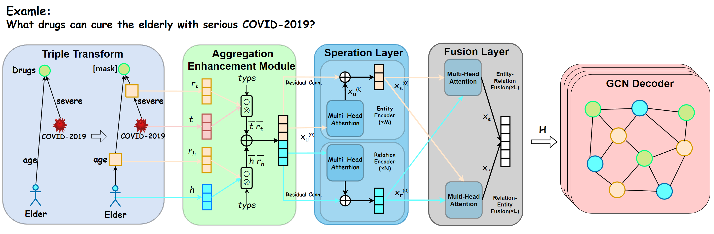

# TransFOL




**This is the data and code for our paper** [`TransFOL: A Logical Query Model Based on Cross-Transformer for Drug–Drug Interaction Prediction`](https://pubmed.ncbi.nlm.nih.gov/38743532/).

---

**(2024.5.18) We found that there are some bugs in the uploaded python files that will cause training failures and parameter errors to be transmitted to the CPU. We have fixed them. If you find any problems or have any needs, please contact the email `chengjunkai829@gmail.com`.**

**(2024.10.10) We are trying to upgrade the pytorch version to 2.3.1.**

## Prerequisites

* `pytorch>=1.7.1 & <=1.9`
  * Note: Pytorch version greater than 1.9 has OOM bugs. See <https://github.com/pytorch/pytorch/issues/67680>.
* `torch-geometric`

Example installation using [`conda`](https://conda.io):

```bash
conda create -n TransFOL python=3.8
conda install cudatoolkit=10.2
pip install torch==1.8.1+cu102 torchvision==0.9.1+cu102 -f https://download.pytorch.org/whl/torch_stable.html
pip install torch_scatter torch_sparse torch_cluster torch_spline_conv -f https://data.pyg.org/whl/torch-1.8.1+cu102.html
pip install torch-geometric==2.0.4
```

## Datastes

We provide the dataset in the [data](data/) folder.

| Data | Source | Description |
| --- | --- | --- |
| [Drugbank](data/drugbank/)| [This link](https://bitbucket.org/kaistsystemsbiology/deepddi/src/master/data/) | A drug-drug interaction network betweeen 1,709 drugs with 136,351 interactions. |
| [TWOSIDES](data/TWOSIDES/) | [This link](http://snap.stanford.edu/biodata/datasets/10017/10017-ChChSe-Decagon.html) | A drug-drug interaction network betweeen 645 drugs with 46,221 interactions. |
| [DrugCombDB](data/DrugCombDB) | [This link](http://drugcombdb.denglab.org/) | An integrated biomedical network contains more than 4 million drugs and other entities. We extract a subgraph dataset containing the relationship "*drug-dose-target-response*" from it.|
| [Phenomebrowser](data/Phenomebrowser) | [This link](http://www.phenomebrowser.net/#/) | An integrated biomedical network include  61,146 medical entities and 1,246,726 medical entity pairs.  We extract sub-datasets that contain the "*mammal symptom-human symptom-drug-disease*" relationship from it. |

## Reproduction

The parameters in the paper is preloaded in [`./src/configs/`](src/configs/).
Change `root_dir` option for the location to save model checkpoints.

The location for the extracted dataset
should be specified in the `data_dir` in the config files.
For exmpale, if the `drugbank` dataset is in `/data/drugbank`,
this is what the `data_dir` options should be set.

Alternatively, pretrained models are available
at [Google Drive](https://drive.google.com/drive/folders/1FI4TqRI_bXUSNMAuf0F2qUCmUQGjtn_j).

To reproduce all results for `drugbank`:

```bash
transfol="python main.py -c configs/drugbank.json"
$ transfol training_2i 
$ transfol testing_2i
```

## Documentation

```
src
  │  data_util.py
  │  deter_util.py
  │  graph_util.py
  │  main.py
  │  metric.py
  │  model.py
  │  sampler.py
  │  train.py
  ├─configs
        │  configs.json
  ├─pretrained_model
  └─tasks
        │  base.py
        │  betae.py
        │  pretrain.py
        │  real_query.py
        │  reasoning.py
        │  __init__.py
```

### Model

The basic structure of our model an be found in `model.py`.
The model can be divided into 4 parts, triplet transform, enhancement module, Cross-Transformer and GCN decoder. They can be used in function `TokenEmbedding`, `Cross_Transformer` and `GCN`.

### Training

Training-related utilities can be found in [`train.py`](./src/train.py).
They accept `Iterator`'s that yield batched data,
identical to the output of a `torch.utils.data.DataLoader`.
The most useful functions are `main_mp()` and `ft_test()`.

`TrainClient` scatters data onto different workers
and perform multi-GPU training based on `torch.nn.parallel.DistributedDataParallel`.

### Config Files

Each config file is a JSON key-value mapping that maps a task name to a task.
The tasks can be run directly from the command line:

```bash
python main.py <task_name> [<task_name>...]
```

In a specific task, `base` option specifies the task it should inherit from.
`type` option specifies the type of operation of this configuration.
See [`./src/main.py`](./src/main.py) for a full list of available options.

## Troubleshooting

<details>

<summary>CUDA Out of Memory</summary>

We run experiments with V100(32GB) GPU, please reduce the batch size if you don't have enough resources. Be aware that smaller batch size will hurt the performance for contrastive training
If the issue persists after adjusting batch size, downgrade pytorch to as early as possible (e.g. LTS 1.8.1 as of 2021/03).
This is possibly due to memory issues in higher pytorch versions.
See <https://github.com/pytorch/pytorch/issues/67680> for more information.

</details>

<details>

<summary>torch-geometric installation is failed</summary>

Please try downgrading the cuda version. Due to library dependency, torch_cluster, torch_scatter, torch_sparse and torch_spline_conv are required to install torch-geometric installations.

</details>

## Authors

**Junkai Cheng** @github.com/Cheng0829 \
**Email:** chengjunkai829@gmail.com & Cheng0829@dlmu.edu.cn \
**Site:** [GitHub](https://github.com/Cheng0829)

**Yijia Zhang** @github.com/ItrecTextming \
**Email:** zhangyijia@dlmu.edu.cn \
**Site:** [GitHub](https://github.com/ItrecTextming)

## Citation

If you find our work helpful, feel free to give us a cite.

```
@ARTICLE{10530338,
  author={Cheng, Junkai and Zhang, Yijia and Zhang, Hengyi and Ji, Shaoxiong and Lu, Mingyu},
  journal={IEEE Journal of Biomedical and Health Informatics}, 
  title={TransFOL: A Logical Query Model for Complex Relational Reasoning in Drug-Drug Interaction}, 
  year={2024},
  volume={28},
  number={8},
  pages={4975-4985},
  keywords={Drugs;Task analysis;Cognition;Knowledge graphs;Predictive models;Biological system modeling;Diseases;Drug-drug interaction;logical query;trans- former;graph convolutional network;knowledge graph},
  doi={10.1109/JBHI.2024.3401035}}
```

## Acknowledgement

We refer to the code of [kgTransformer](https://github.com/THUDM/kgTransformer). Thanks for their contributions.

